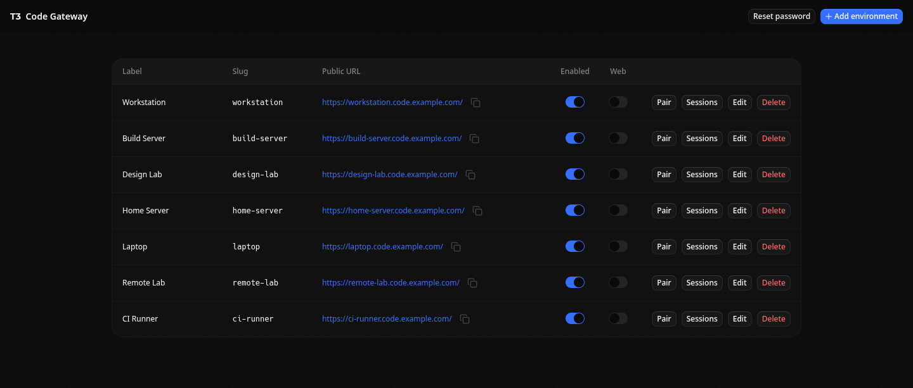
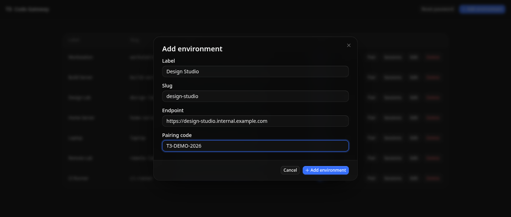
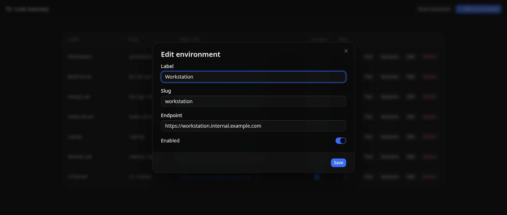
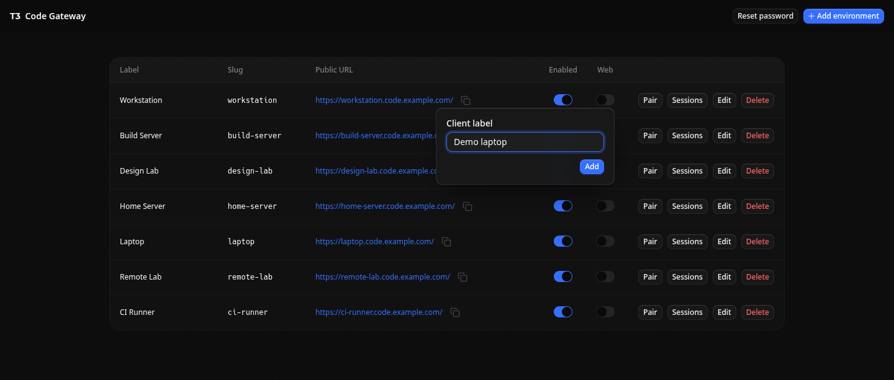
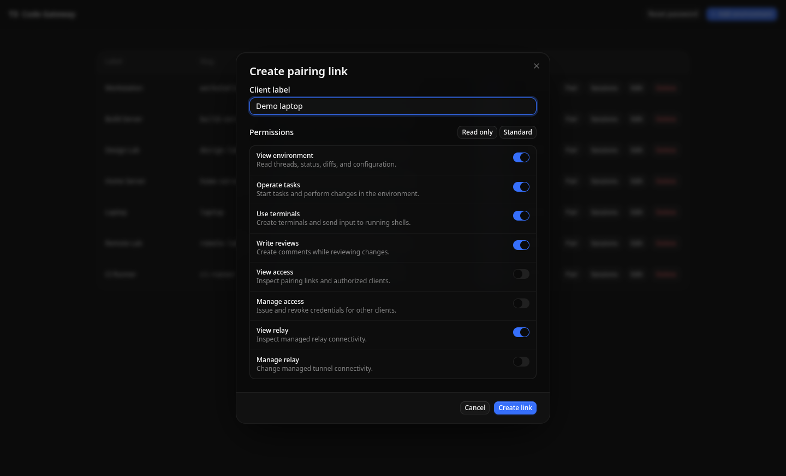
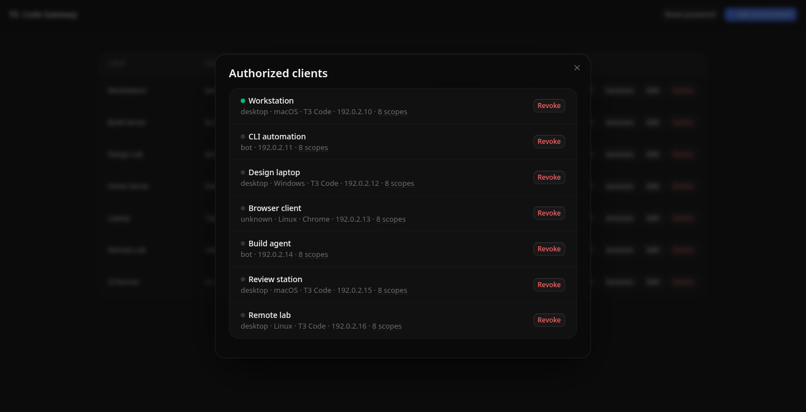

# T3 Code Gateway

T3 Code Gateway manages multiple self-hosted T3 Code environments behind one public entry point.
It provides an admin UI, optional T3 Code Web, Traefik routes, encrypted environment credentials,
pairing links, and client session controls.

Normal T3 Code traffic goes directly from Traefik to each configured environment. The gateway only
manages configuration, credentials, and access.

## Screenshots

### Environment management







### T3 Code Web



### Pairing and access





See [the screenshot package](packages/screenshots/README.md) to regenerate them.

## Run

Images are published to `ghcr.io/tarik02/t3code-gateway`.

```sh
docker run \
  --name t3code-gateway \
  --restart unless-stopped \
  -p 8787:8787 \
  -v t3code-gateway-data:/data \
  -e T3_GATEWAY_PUBLIC_BASE_DOMAIN=code.example.com \
  ghcr.io/tarik02/t3code-gateway:<version>
```

Open `/admin/login`. On first start, the gateway logs the generated password for the `admin` user.

Use an external Traefik instance with `/data/traefik/environments.yml`, or enable the bundled one
with `T3_GATEWAY_BUNDLED_TRAEFIK_ENABLED=true` and expose ports `80` and `443`.

## Development

```sh
pnpm install
pnpm build
```

## License

MIT
