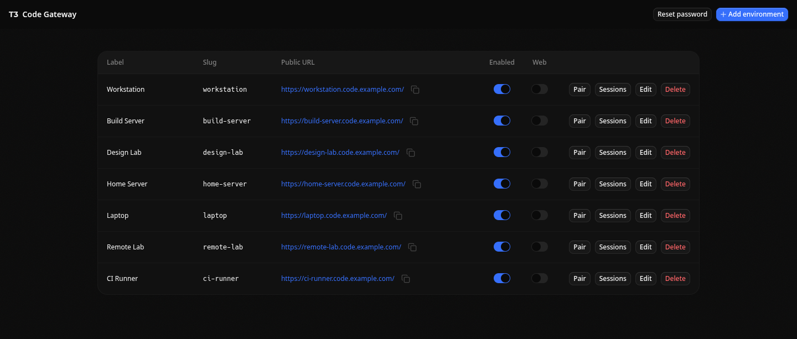
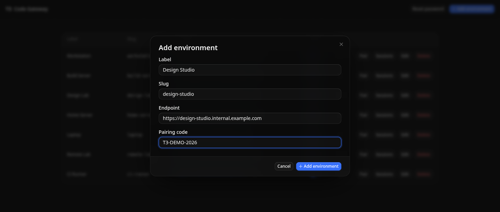
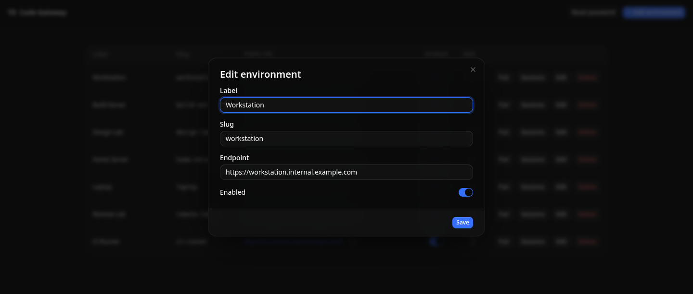
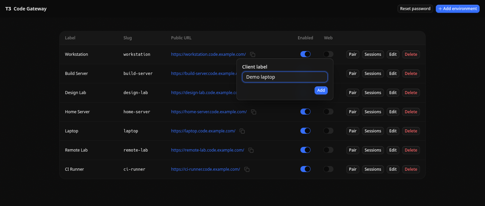
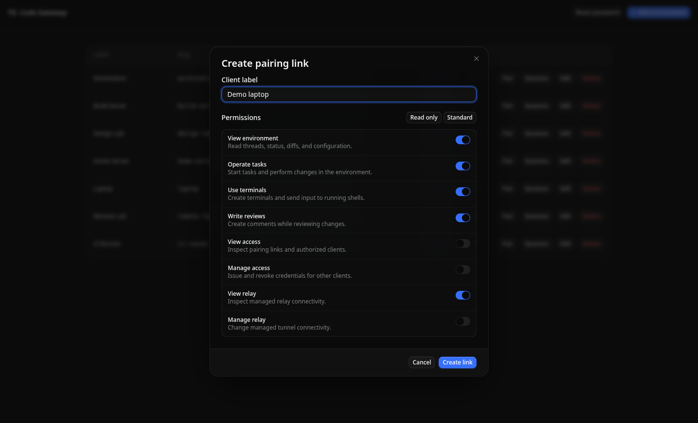
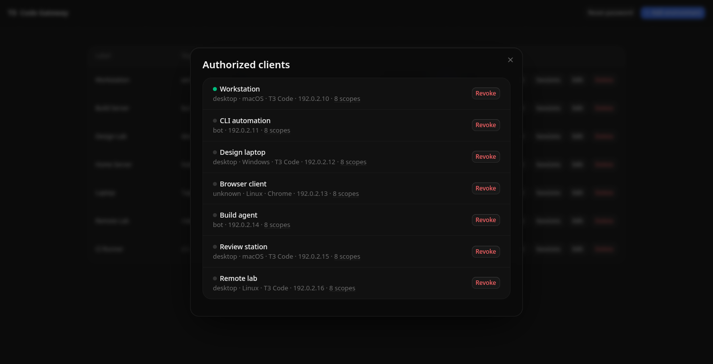

# T3 Code Gateway

T3 Code Gateway manages multiple self-hosted T3 Code environments behind one public entry point.
It provides an admin UI, optional T3 Code Web, Traefik routes, encrypted environment credentials,
pairing links, client session controls, and one MCP server that relays every environment.

Normal T3 Code traffic goes directly from Traefik to each configured environment. The gateway only
manages configuration, credentials, and access.

## Screenshots

### Environment management







### T3 Code Web



### Pairing and access





See [the screenshot package](packages/screenshots/README.md) to regenerate them.

## Run

Images are published to `ghcr.io/tarik02-org/t3code-gateway`.

```sh
docker run \
  --name t3code-gateway \
  --restart unless-stopped \
  -p 8787:8787 \
  -v t3code-gateway-data:/data \
  -e T3_GATEWAY_PUBLIC_BASE_DOMAIN=code.example.com \
  ghcr.io/tarik02-org/t3code-gateway:<version>
```

Open `/admin/login`. On first start, the gateway logs the generated password for the `admin` user.

The image includes both stable and nightly T3 Code Web builds. After signing in, use the `T3 Code
Versions` button to switch channels, pin versions, collect unused downloads, enable automatic
updates, or check for an update immediately.
GitHub-backed automatic updates are disabled by default; downloaded builds are stored in the gateway
data volume.

Update checks call the GitHub API, which allows 60 unauthenticated requests per hour per IP. Set a
token with no scopes in the `T3 Code Versions` dialog, or pass `T3_GATEWAY_GITHUB_TOKEN` to the
container (for example from a secret), to raise the quota to 5,000 requests per hour. The dialog
value is encrypted at rest with the gateway secret key, like environment tokens. When both are
set, the admin UI value wins; clearing it falls back to the environment variable.

Use an external Traefik instance with `/data/traefik/environments.yml`, or enable the bundled one
with `T3_GATEWAY_BUNDLED_TRAEFIK_ENABLED=true` and expose ports `80` and `443`.

## MCP relay

Agents connect to `https://<gateway host>/mcp` once and reach every environment they are allowed
to. Every T3 Code tool gets an `environment` argument naming the environment it runs in, and
`gateway_list_environments` lists them. The `Connections` page in the admin UI shows setup for
common agents and the connected agents; the `MCP` column on `Environments` shows the gateway's own
sign-in to each environment.

- Agents that support MCP OAuth sign in with just the URL. An admin approves them in the browser
  and picks their access level and environments.
- Other agents use a token created on the `Connections` page, sent as `Authorization: Bearer <token>`.

T3 Code enforces the access level itself: the gateway signs in to each environment once per access
level in use and relays every call with the matching credential. Environments need a T3 Code build
with MCP OAuth for outside agents (pingdotgg/t3code#16336).

OAuth URLs come from the request, so the proxy in front of the gateway must pass `Host` (or
`X-Forwarded-Host`) and `X-Forwarded-Proto`. Behind a proxy that reports the wrong scheme (for
example a TLS-terminating CDN in front of a plain-HTTP hop), set `T3_GATEWAY_PUBLIC_URL` to the
gateway's public origin.

## Development

```sh
pnpm install
pnpm build
```

## License

MIT
